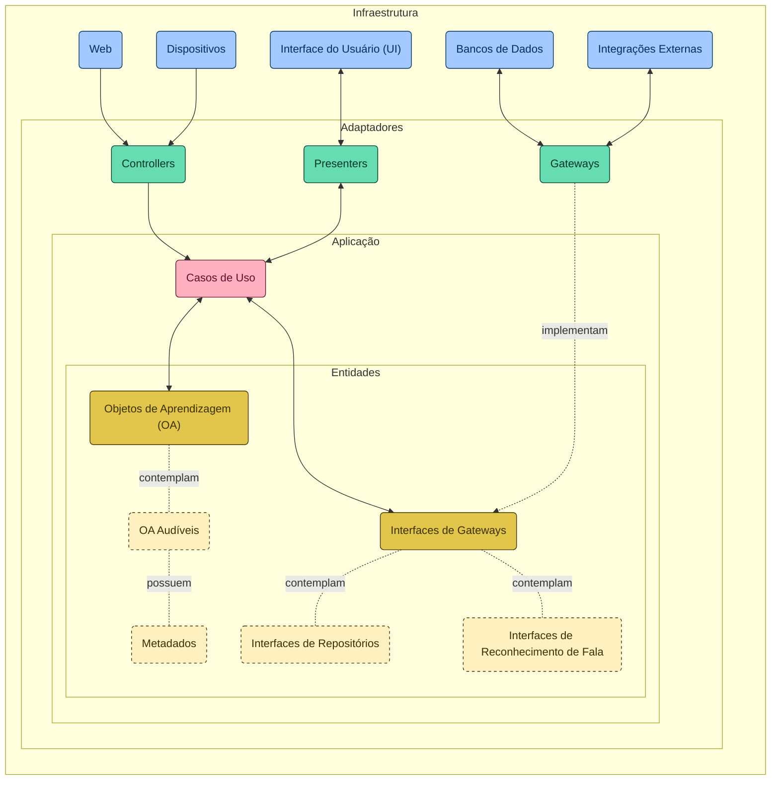

# Arquitetura Speech2Learning (S2L)

Este repositório documenta o doutorado de Venilton FalvoJr (@falvojr) e suas contribuições-chave: a Arquitetura Speech2Learning e duas instâncias desenvolvidas em colaboração com a EdTech DIO.

A Speech2Learning é uma arquitetura que busca proporcionar uma abstração de software para aprimorar a acessibilidade de conteúdos educacionais por meio do reconhecimento de fala. Em particular, a Speech2Learning concentra-se em tornar os conteúdos audíveis acessíveis, convertendo-os em texto. Isso possibilita a criação de transcrições, legendas ou sinalizações em línguas de sinais, por exemplo, por meio de avatares de LIBRAS baseados em texto. Além disso, essa proposta está alinhada com os conceitos de Objetos de Aprendizagem (OA) e Recursos Educacionais Abertos (REAs), que foram integrados à arquitetura para padronizar a criação de artefatos educacionais reutilizáveis e, preferencialmente, licenciados de forma aberta.

## Mapeamento Sistemático da Literatura

Antes de desenvolver a Arquitetura Speech2Learning, realizamos um Mapeamento Sistemático (MS) para entender como a tecnologia tem contribuído para o ensino e aprendizagem por meio das línguas de sinais (FalvoJr et al., [2020a](https://doi.org/10.5753/cbie.sbie.2020.812); [2020b](https://doi.org/10.1109/FIE44824.2020.9274169); [2020c](https://doi.org/10.22456/1679-1916.110217)). O MS identificou 185 estudos primários, oferecendo uma visão geral das principais soluções tecnológicas relacionadas à educação para surdos, com foco na Língua Brasileira de Sinais (LIBRAS).

Em resumo, o MS concluiu que a tecnologia já desempenha um papel significativo no ensino e aprendizagem por meio das línguas de sinais. No entanto, os estudos primários carecem de padrões e boas práticas de desenvolvimento que possam facilitar o compartilhamento de seus objetos de aprendizagem. Diante dessa necessidade, a arquitetura de software Speech2Learning foi concebida para promover a construção de soluções que estejam estruturalmente preparadas para a inclusão de pessoas surdas no processo de ensino e aprendizagem, tornando os conteúdos educacionais audíveis acessíveis.

## Principais Influências

A Arquitetura Speech2Learning é uma adaptação da [Clean Architecture](https://blog.cleancoder.com/uncle-bob/2012/08/13/the-clean-architecture.html) de Robert Martin (Uncle Bob) para tornar objetos de aprendizagem acessíveis por meio do reconhecimento de fala. A Clean Architecture combina ideias-chave da Engenharia de Software, como a [Hexagonal Architecture](https://alistair.cockburn.us/hexagonal-architecture), a [Onion Architecture](https://jeffreypalermo.com/2008/07/the-onion-architecture-part-1), o paradigma [Data, Context and Interaction (DCI)](https://www.amazon.com/Agile-Software-Architecture-Paradigm-Orientation-ebook/dp/B019ZTY6EM) e o padrão [Boundary, Control and Entity (BCE)](https://www.amazon.com/Object-Oriented-Software-Engineering-Approach/dp/0201544350). Todas essas abordagens compartilham a ideia de separar o código em camadas independentes, colocando o domínio no centro da arquitetura, permitindo a criação de sistemas altamente testáveis, independentes de tecnologia e adaptáveis às necessidades do projeto.

A grande aceitação da Clean Architecture na indústria a torna uma referência sólida para abordar os desafios identificados no Mapeamento Sistemático da Literatura. A Arquitetura Speech2Learning mantém as características essenciais da Clean Architecture, formalizando aspectos cruciais para a acessibilidade de OA audíveis. Com isso, nosso objetivo é estabelecer uma estrutura que facilite a criação de soluções educacionais acessíveis, beneficiando aprendizes surdos por meio de transcrições interpretadas por avatares de línguas de sinais, como o [Hand Talk](https://www.handtalk.me/) e [VLibras](https://www.gov.br/governodigital/pt-br/vlibras), que se destacaram em nosso MS.

Aqui está o diagrama da Arquitetura Speech2Learning para uma visualização mais clara:

## Instâncias da Speech2Learning

Aqui estão as duas instâncias criadas como mecanismos de avaliação indireta da Arquitetura Speech2Learning:

1. **Legendas Automáticas de Videoaulas**: Inclui Prova de Conceito (PoC), Estudo de Caso e uma pesquisa abrangente focada na qualidade das transcrições automáticas de importantes provedores de Speech-To-Text (STT) em todo o mundo.

2. **Player de Vídeo com Design Acessível**: Envolve uma PoC e um Experimento com ênfase na qualidade do player de vídeo, especialmente para o público surdo, usando avatares de LIBRAS baseados em texto (a partir da transcrição das videoaulas).
