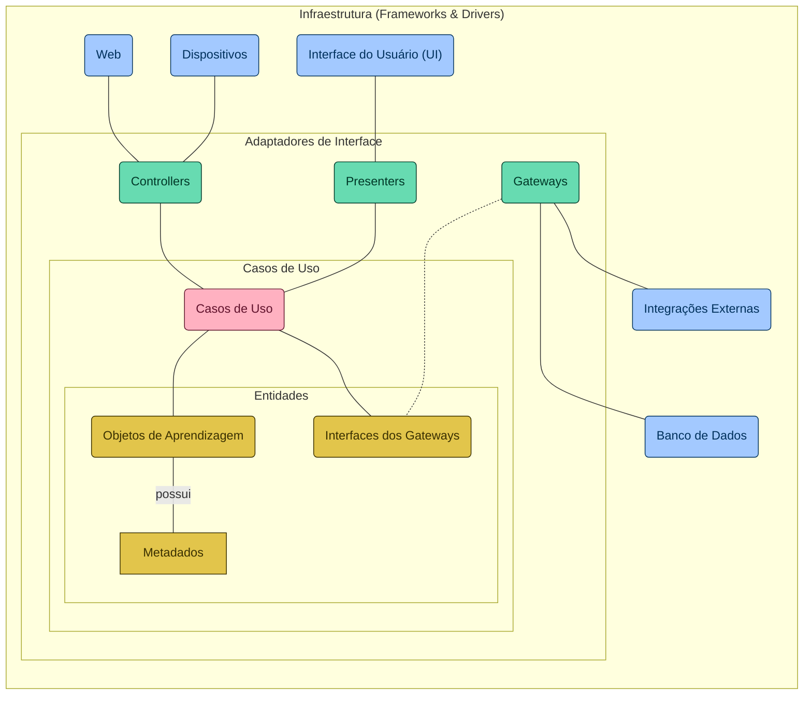

# Arquitetura Speech2Learning

Repositório com diagramas e artefatos da Speech2Learning, uma arquitetura baseada em reconhecimento de fala para acessibilidade de conteúdos educacionais audíveis.

## Diagram de Componentes

