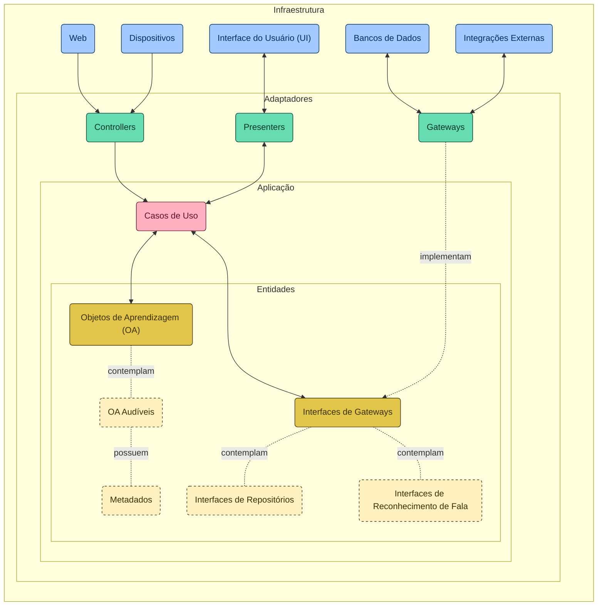

```mermaid
graph RL;
  subgraph layer-infra[Infraestrutura];
    Web(Web) --> Con
    Dis(Dispositivos) --> Con
    UI("Interface do Usuário (UI)") <--> Pre
    BD(Bancos de Dados) <--> Gat
    EXT(Integrações Externas) <--> Gat

    subgraph layer-adpaters[Adaptadores];
      Con(Controllers) --> UC
      Pre(Presenters) <--> UC
      Gat(Gateways) -...-> |implementam| IGat

      subgraph layer-app[Aplicação];
        UC(Casos de Uso) <--> OA
        UC <--> IGat

        subgraph layer-entities[Entidades];
          OA("Objetos de Aprendizagem (OA)")
          OA -.- |contemplam| OAA(OA Audíveis)
          OAA -.- |possuem| Meta(Metadados)
          IGat(Interfaces de Gateways)
          IGat -.- |contemplam| IRep(Interfaces de Repositórios)
          IGat -.- |contemplam| IS2T(Interfaces de Reconhecimento de Fala)
        end
     end
    end
  end

classDef infra fill:#a3c9ff,stroke:#00315c,color:#00315c;
classDef adapters fill:#67dbb1,stroke:#003828,color:#003828;
classDef ucs fill:#ffb1c1,stroke:#5f112b,color:#5f112b;
classDef entities fill:#e2c54b,stroke:#3a3000,color:#3a3000;
classDef entities_secondary fill:#fff0c0,stroke:#3a3000,color:#3a3000,stroke-dasharray: 4 4;

class Web,Dis,UI,BD,EXT infra;
class Con,Gat,Pre adapters;
class UC ucs;
class OA,IGat entities;
class OAA,Meta,IRep,IS2T entities_secondary;
```
