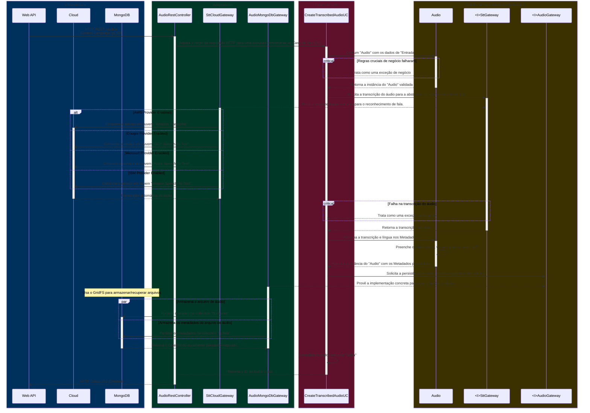

```mermaid
sequenceDiagram
    box rgb(0, 49, 92) Infraestrutura
    participant API as Web API
    participant Cloud
    participant MongoDB
    end
    box rgb(0, 56, 40) Adaptadores
    participant Controller as AudioRestController
    participant SttGateway as SttCloudGateway
    participant DataGateway as AudioMongoDbGateway
    end
    box rgb(95, 17, 43) Casos de Uso
    participant CreateUC as CreateTranscribedAudioUC
    end
    box rgb(58, 48, 0) Objetos de Aprendizagem #40;Entidades#41;
    participant Entity as Audio
    participant ISttGateway as #60;I#62;SttGateway
    participant IDataGateway as #60;I#62;AudioGateway
    end
    
    API-)+Controller: HTTP POST /audios<br/>Content-Language: pt_BR
    Controller->>+CreateUC: Adpata o corpo da requisição HTTP para uma estrutura conveniente ao Caso de Uso (UC)
    CreateUC->>+Entity: Cria um "Audio" com os dados de "Entrada"
    critical Regras cruciais de negócio falharam
        Entity--xCreateUC: Trata como uma exceção de negócio
    end
    Entity-->>-CreateUC: Retorna a instância do "Audio" validada
    CreateUC->>+ISttGateway: Solicita a transcrição do áudio para a abstração de reconhecimento de fala
    SttGateway-->>ISttGateway: Provê a implementação concreta para o reconhecimento de fala.
    activate SttGateway
    alt AWS Provider Enabled
        SttGateway-)+Cloud: Consome o serviço em nuvem "Amazon Transcribe".
    else Google Provider Enabled
        SttGateway-)Cloud: Consome o serviço em nuvem "GCP Speech-To-Text".
    else Microsoft Provider Enabled
        SttGateway-)Cloud: Consome o serviço em nuvem "Azure Speech-To-Text".
    else IBM Provider Enabled
        SttGateway-)Cloud: Consome o serviço em nuvem "Watson Speech-To-Text".
    end
    Cloud--)-SttGateway: Transcrição automática do áudio
    deactivate SttGateway
    critical Falha na transcrição do áudio
        ISttGateway--xCreateUC: Trata como uma exceção de negócio
    end
    ISttGateway-->>-CreateUC: Retorna a transcrição do áudio.
    CreateUC->>+Entity: Adiciona a transcrição e língua nos Metadados.
    Entity->>Entity: Preenche os Metadados, versionando-os como "v0".
    Entity-->>-CreateUC: Retorna a instância do "Audio" com os Metadados preparados.
    CreateUC->>+IDataGateway: Solicita a persistência do áudio e seus respectivos Metadados.
    DataGateway-->>IDataGateway: Provê a implementação concreta para a persistência de dados.
    activate DataGateway
    Note over MongoDB: Usa o GridFS para armazenar/recuperar arquivos
    par Armazena o arquivo de áudio
        DataGateway-)+MongoDB: Persiste o arquivo na collection "fs.chunks".
    and Armazena os metadados do arquivo de áudio
        DataGateway-)MongoDB: Persiste os metadados na collection "fs.files".
    end 
    MongoDB--)-DataGateway: Retorna o ObjectId do documento persistido/mapeado.
    deactivate DataGateway
    CreateUC->>CreateUC: Consolida os dados em uma "Saida"
    CreateUC -->- Controller: Retorna o ID do Audio criado
    Controller--)-API: HTTP Status 203 (Created)

```
